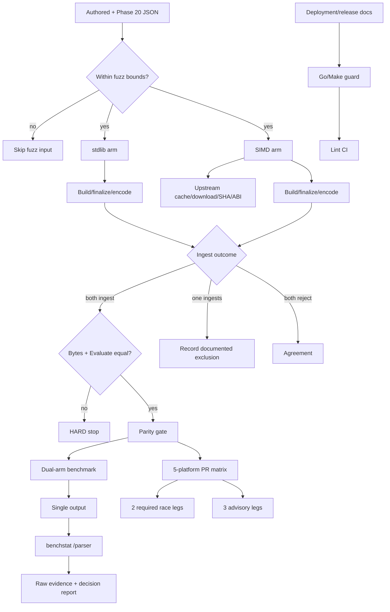

# Phase 22: SIMD Validation, Benchmarks & CI - Research

**Researched:** 2026-07-31
**Domain:** Go differential validation, native-library CI, reproducible benchmarking, and executable deployment guidance
**Confidence:** HIGH

<user_constraints>
## User Constraints (from CONTEXT.md)

**Provenance for this complete constraints block:** copied from `22-CONTEXT.md`; wording within the locked-decision, discretion, and deferred sections is verbatim. [VERIFIED: codebase grep]

### Locked Decisions

## Phase Boundary

Prove the SIMD path is correct, measurable, and operationally shippable. Satisfies SIMD-08..11 (ROADMAP Phase 22 success criteria 1-4).

This phase produces **evidence and enforcement infrastructure**. It does NOT change SIMD parsing behavior, does NOT change the parser API, does NOT add a CLI flag, and does NOT alter default stdlib behavior.

**Pre-locked by Phase 19 (`19-SIMD-STRATEGY.md`) — do NOT re-open:**
- Supported platform set: `linux/amd64`, `linux/arm64`, `darwin/amd64`, `darwin/arm64`, `windows/amd64`.
- Release asset labels: `linux-amd64`, `linux-arm64`, `darwin-amd64`, `darwin-arm64`, `windows-amd64-msvc`.
- Native loading (download, cache, mirror, flock, SHA-256, ABI) is **entirely upstream's**. ami-gin adds only API shape and a friendlier construction-error message. Phase 22 must not re-verify upstream's bootstrap suite from downstream.
- Stop table: non-parity encoded bytes or query results vs stdlib = **HARD** (halt, defer SIMD to v1.4). One of 5 CI platforms failing while others pass = **SOFT** (document as tier 2, manual verification until resolved). Speedup below expectations = "decide on evidence."
- Documented env vars: `PURE_SIMDJSON_LIB_PATH`, `PURE_SIMDJSON_BINARY_MIRROR`, `PURE_SIMDJSON_DISABLE_GH_FALLBACK`, `PURE_SIMDJSON_CACHE_DIR`.

**Pre-locked by Phase 21 (`21-CONTEXT.md`) — do NOT re-open:**
- `//go:build simdjson` isolation; `make simd-isolation-check` enforces that `go list -deps -test ./...` (test deps included) contains no `pure-simdjson` in a default build, and that every importer carries the tag on line 1 exactly.
- D-05's original framing is **superseded in the tree**: `routeSIMDWellFormedFallback` (`parser_simd.go:60`) reconciles well-formed >uint64 integers, so those documents are byte-identical in both soft and hard failure modes. See D-04 below for what actually survives.

**Ground-truth verified during discussion (2026-07-31, measured in a throwaway clone):**
- `parser_simd_integration_test.go:27` **already contains** `TestSIMDParserGoldenAuthoredFixtures`, running `NewSIMDParser()` over all 12 `authoredParityFixtures()` against `testdata/parity-golden/*.bin`. The authored-fixture half of SC#1 is already discharged. `parser_parity_simd_test.go` is not the whole SIMD parity surface.
- **stdlib and SIMD are already byte-identical on all four Phase 20 fixtures** — nested 10,920 B / mixed-arrays 7,478 B / number-heavy 6,432 B / combined 18,309 B; 0.12 s plain, 2.5 s with `-race` including build. Phase 22 is pinning a passing invariant, not discovering one.
- **`go.mod` is on `github.com/amikos-tech/pure-simdjson v0.1.7`, not the `v0.1.4` hardcoded into Phase 19's cache-key pattern.** Every version reference must derive from `go list -m`, never a literal.
- `parser_stdlib.go` is **untagged**, so under `-tags simdjson` both parsers are in scope in one binary. `parser_simd_integration_test.go:216` already compares `stdlibParser{}` against a SIMD parser in a single tagged file. There is no need for two-tag-set invocations anywhere in this phase.
- Two live doc defects exist: `docs/simd-deployment.md:91` links to upstream **`/blob/main/docs/bootstrap.md`** while NOTICE.md pins every upstream link to the effective version tag (`/blob/v0.1.7/...` verified to resolve 200); and nothing fails if `docs/simd-deployment.md` is renamed while `parser_simd.go:43`'s `initializationContext` string keeps naming it.

**Pre-plan de-risking checks (2026-07-31) — these questions are CLOSED, do not re-investigate:**
- **All five v0.1.7 release assets exist**, each with `.sig` + `.pem` alongside a signed `SHA256SUMS`: `libpure_simdjson-{darwin-amd64.dylib, darwin-arm64.dylib, linux-amd64.so, linux-arm64.so}` and `pure_simdjson-windows-amd64-msvc.dll`. D-05's platform set is asset-backed at the current pin; no leg is aspirational.
- **Upstream already validates the identical runner matrix nightly.** `pure-simdjson`'s `public-bootstrap-validation.yml` (cron `23 6 * * *`, `fail-fast: false`) runs exactly `ubuntu-latest` / `ubuntu-24.04-arm` / `macos-15-intel` / `macos-15` / `windows-latest` — the same five labels D-05 locks — and the last three scheduled runs (2026-07-29, 07-30, 07-31) were all green. This is independent confirmation that the labels are current and that bootstrap + native load work on all five. **Residual risk is only whether ami-gin's own tagged suite passes there, which is precisely what D-05's advisory tier absorbs — this does NOT need a spike.**
- **Every sentinel D-07 needs is exported by upstream**, and more besides: `ErrCPUUnsupported`, `ErrABIVersionMismatch`, `ErrChecksumMismatch`, `ErrAllSourcesFailed`, plus `ErrClosed`, `ErrParserBusy`, `ErrInvalidHandle`, `ErrDepthLimitExceeded`, `ErrCapacityLimitExceeded`, `ErrPrecisionLoss`, `ErrNumberOutOfRange`, `ErrWrongType`, `ErrPanic`, `ErrInternal`.
- **D-15's source-of-truth path is reachable.** `go list -m -f '{{.Dir}}'` resolves to the read-only module cache and all four env-var constants are present there. Upstream is on `github.com/ebitengine/purego v0.10.0` and ships a `library_windows.go`, so the Windows loader is a first-class upstream path rather than an untested edge.

## Implementation Decisions

### Parity Coverage & Oracle (SIMD-08 / SC#1)

- **D-01: Tagged differential + Evaluate cross-check — no new goldens.** Three layers:
  1. **Authored fixtures keep the existing golden oracle.** `TestSIMDParserGoldenAuthoredFixtures` already does this; extend only if a fixture is missing.
  2. **Phase 20 datasets get a live stdlib-vs-SIMD byte comparison.** A `//go:build simdjson` test iterates `phase20SmokeFixtures` (untagged, `benchmark_test.go:1792`) via `phase20LoadRawJSONL` (`benchmark_test.go:1811`), builds+encodes under both parsers in one process, and asserts byte equality with the existing `assertByteIdentical`.
  3. **Query-result parity.** Reuse the `TestParserParity_EvaluateMatrix` 24-case matrix plus each fixture's `phase20SmokeQuery.predicate`. Requires a ~2-line untagged refactor of `buildEvaluateMatrixIndex` to accept a `WithParser` option.
  - **Rationale:** goldens are for oracles that cannot run in-process (Go's own `regexp` pins RE2 that way *because* RE2 is out-of-process). Both parsers here run in one binary under one build tag, so a live differential is the idiomatic oracle. Checked-in Phase 20 goldens were explicitly rejected — see D-03.
  - Byte-identical encoded indexes provably yield identical `Evaluate` results (every field `Evaluate` reads is serialized or derived from serialized state; `pathLookup` and friends are explicitly non-serialized derived state per `gin.go:75`). The query assertion is therefore defense-in-depth and a directly checkable restatement of SC#1, not new machinery.

- **D-02: Add `FuzzParserParity` — a tagged differential fuzz target, seed corpus executed in CI, real fuzzing on demand.**
  - Seeds drawn from authored fixtures + Phase 20 JSONL lines, committed under `testdata/fuzz/`.
  - **CI runs seeds only.** A Go fuzz target invoked without `-fuzz` executes its seed corpus as an ordinary deterministic test, so this adds near-zero time to the existing tagged run and no new job.
  - Real discovery is manual: `go test -tags simdjson -fuzz=FuzzParserParity`. Any crasher found gets promoted into the committed seed corpus so it becomes a permanent regression.
  - **Rationale:** matches the closest ecosystem precedent — minio/simdjson-go verifies `encoding/json` parity by differential fuzzing rather than goldens. D-01 closes SC#1; D-02 buys discovery of divergences nobody thought to author.

- **D-02a: MANDATORY input guard — skip inputs with array nesting depth > 8 or length > 4096 bytes.** Not optional and not a nicety. Spike 002 (Q5) proved `stageMaterializedValue` is **O(2^depth)** for nested arrays on *both* parser arms, because `builder.go:619-627` recurses twice per element (once as `[i]`, once as `[*]`). A 37-byte depth-18 input costs >3 s of CPU. Without the guard the fuzzer appears to hang; with a loose guard it silently under-fuzzes — measured A/B: depth 12 sat at 0 execs/sec for 30 of 60 seconds and found 21 new interesting inputs, while depth 8 found **85** in 45 seconds.

- **D-02b: The harness reuses ONE parser and needs no poisoned-parser recovery logic.** Construct before `f.Fuzz`, close in `f.Cleanup`. Spike 002 established: (a) the builder's tragic path requires a native *document-close* failure (`parser_simd.go:133-162`), which is unreachable from public-API input and already covered by Phase 21's injected-fake lifecycle tests — 88 swept inputs poisoned nothing; (b) one parser survived 25,200 builder cycles with zero drift, zero failures, and no `PURE_SIMDJSON_WARN_LEAKS` warnings; (c) per-iteration construction also works (~1.1 µs warm, 5,581 full cycles/sec) but buys nothing.

- **D-02c: Classify differential outcomes three ways.** Both arms ingest → assert byte equality; a mismatch is the Phase 19 **HARD stop**. Exactly one ingests → the D-04 documented-exclusion class; record, do not fail. Both reject → agreement. Spike 002's deterministic run over 88 seeds + adversarial inputs returned `agree=88, asymmetry=0, byteDivergence=0`, and ~361,000 fuzz executions produced zero crashers — **day-one expectation is zero divergences**, consistent with this phase pinning a passing invariant.

- **D-03: Do NOT extend the golden corpus to Phase 20 data.** Rejected: +~42 KB of incompressible binary (4.2× the current ~10 KB corpus), and a double-regeneration coupling where re-running `testdata/phase20/generate.go` silently invalidates the goldens. It also would not remove the need for a differential.

- **D-04: The surviving stdlib/SIMD divergence is asserted explicitly, not scoped out.** After `routeSIMDWellFormedFallback`, the only divergence is **failure-layer attribution on malformed documents** (`1e400 garbage` → stdlib reports numeric-layer soft-skip, SIMD reports a parser-layer error). It does not affect encoded bytes — both leave the builder uncommitted — and it is already pinned by `TestSIMDParserMalformedTrailingNumericKnownPolicyAsymmetry` (`parser_simd_integration_test.go:378`). No Phase 20 document triggers it (a scan found only `±9223372036854775807` and `9007199254740993`, all in range).
  - **SC#1 claim wording must be:** "identical encoded indexes and query results for documents that ingest without a parser-layer error," with failure-layer attribution named as an explicit, tested exclusion.
  - This keeps the Phase 19 HARD-stop trigger unambiguous: a byte or `Evaluate` diff halts the phase; a documented layer-attribution diff on malformed input does not.

### CI Matrix Scope & Policy (SIMD-10 / SC#3)

- **D-05: Tiered 5-platform matrix on every PR — 2 required, 3 advisory.**
  - **Required (block merge):** `linux/amd64` (`ubuntu-latest`), `darwin/arm64` (`macos-15`).
  - **Advisory (`continue-on-error: true`):** `linux/arm64` (`ubuntu-24.04-arm`), `darwin/amd64` (`macos-15-intel`), `windows/amd64` (`windows-latest`).
  - `fail-fast: false`.
  - **Rationale:** this encodes Phase 19's SOFT stop directly in YAML — a single-platform failure is demoted to tier 2 rather than blocking merge, which is exactly what the stop table prescribes. All five runner types are free and unmetered on public repos, so cost is not the constraint; flake-per-PR vs trust-per-PR is. The B+C hybrid (adding a nightly full run) was offered and declined.
  - **Runner labels are pinned deliberately:** `macos-13` was retired 2025-12-04, so darwin/amd64 must use `macos-15-intel`; `macos-latest` flips to `macos-26` between 2026-06-15 and 2026-07-15, so darwin/arm64 pins `macos-15` rather than `macos-latest`. **These exact five labels are what upstream's own nightly `public-bootstrap-validation.yml` uses, green as of 2026-07-31** — copy that matrix's label choices rather than re-deriving them.
  - **`darwin/amd64` is documented tier 2 from day one** on the strength of the Aug 2027 Intel-macOS sunset alone.
  - **Accepted risk:** advisory legs can rot unnoticed (yellow-check blindness). Accepted deliberately; no nightly notifier in this phase.

- **D-06: `-race` on the required tier only.** `linux/amd64` + `darwin/arm64` run `-tags simdjson -race`; the three advisory legs run without `-race`. Windows `-race` needs cgo + a C compiler and is the slowest leg by far. Advisory legs still prove the platform loads and passes, which is what tier-2 status asks of them.

- **D-07: Three-state skip/fail guard — this is what SIMD-10 actually requires.** One test helper:
  1. `runtime.GOOS/GOARCH` outside the locked 5 → `t.Skip("pure-simdjson unsupported platform")`.
  2. Supported platform **and** the CI-only required-flag env var is set → `NewSIMDParser()` failure is `t.Fatal`, with `errors.Is` against upstream sentinels surfaced in the failure message. **Verified exported, use this set:** `ErrCPUUnsupported`, `ErrABIVersionMismatch`, `ErrChecksumMismatch`, `ErrAllSourcesFailed`, and additionally `ErrInvalidHandle` and `ErrClosed` (both diagnostic of a load that half-succeeded).
  3. Supported platform without the flag (local dev, air-gapped) → `t.Skip` with the remediation string.
  - This makes "unsupported platform" a legitimate skip and "supported platform but library failed to load" a hard fail, and makes it impossible for CI to go green by skipping everything.

- **D-08: Cache key derives the version from `go list -m`.** Plain `actions/cache` on `PURE_SIMDJSON_CACHE_DIR`, keyed `pure-simdjson-${{ runner.os }}-${{ runner.arch }}-${{ steps.simd-version.outputs.version }}`, with **no `restore-keys`**. The payload is only ~0.5 MB, so the cache buys network-flake resilience rather than speed, and a fuzzy restore would risk loading an ABI-mismatched library. Phase 19's literal `v0.1.4` in the key pattern is superseded — the repo is on v0.1.7 and bumps are frequent.

### Benchmark Deliverable (SIMD-09 / SC#2)

- **D-09: One tagged dual-arm benchmark, both parsers in one process.** A `//go:build simdjson` benchmark file (e.g. `benchmark_simd_test.go`) with sub-benchmark names carrying a `parser=` key alongside the existing `tier=`/`fixture=` convention. Both arms measured in the same run, interleaved — more comparable than two invocations, not less. Passes `make simd-isolation-check` cleanly because the tagged file is excluded from the default build.
  - Comparison via `benchstat -col /parser out.txt` on a **single** output file. No cross-invocation stitching.

- **D-10: Committed evidence documents are the primary deliverable, following the Phase 11 precedent** — a raw-numbers doc with pinned commands/env/machine, plus a synthesized comparison report ending in a ship/defer/narrow recommendation. This is what Phase 19's stop table ("decide on evidence") actually needs a human to be able to read.

- **D-11: Non-gating CI benchmark artifacts on `push: main` + `workflow_dispatch`, `linux/amd64` only.** Uploads raw benchstat output as an artifact for trend data. **Zero PR cost.** Numbers must be explicitly labeled as shared-runner-noisy (GitHub-hosted runner variance is ~5× dedicated hardware) so nobody mistakes a 4% swing for signal. The committed doc stays authoritative.

- **D-12: No benchstat regression gate.** Rejected: needs `-count=10`+ per arm, and on shared runners any threshold below the ~3% natural movement becomes a flake generator. SIMD-09 asks to *report* a delta, not police one. Backlog it if dedicated bench hardware ever exists.

- **D-13: Report both allocation and throughput.** `-benchmem` B/op + allocs/op (SIMD-09's "allocation"/"bytes/op" clause) **and** `b.SetBytes(inputJSONLen)`-derived MB/s input throughput (already used at `benchmark_test.go:4607`), which is SIMD's headline metric and the one that makes a speedup claim legible. The report must state explicitly which is which.

- **D-14: Fixture tiers mirror the existing split.** Checked-in `testdata/phase20/*.jsonl` is the always-on smoke tier and the only tier whose numbers get committed. The external tier stays behind the already-defined `GIN_PHASE20_ENABLE_SIMDJSON_EXTERNAL` / `GIN_PHASE20_SIMDJSON_DIR` env vars as a local-run escape hatch.
  - Make target follows the `bench-phase20` precedent: scope with `-bench '^BenchmarkSIMD...$'` and add `-tags simdjson`. A bare `-bench .` under the tag would drag in the entire ~141 KB suite.
  - `COUNT ?= 1` stays the Makefile default; override to `COUNT=10` or higher when producing the committed snapshot.

### SIMD-11 Guidance Verification (SC#4)

- **D-15: Doc-drift guard is the primary artifact — a make target + Go test extending the `check-notice-version` precedent.** Asserts, against machine-readable sources of truth already on disk:
  - The four env var names, verified against upstream string constants reachable via `go list -m -f '{{.Dir}}'` (`libraryEnvPath` in `library_loading.go`, `mirrorEnvVar`/`disableGHEnvVar` in `internal/bootstrap/bootstrap.go`, `cacheDirEnvVar` in `internal/bootstrap/cache.go`).
  - The `docs/simd-deployment.md` path string hardcoded in `parser_simd.go:43`'s `initializationContext`.
  - README and CHANGELOG cross-references.
  - Upstream links pinned to the effective version tag, matching NOTICE.md's convention.
  - **Use a deliberate allowlist of the four loading vars.** A naive `PURE_SIMDJSON_*` sweep false-fails on the 40+ diagnostic/error-code tokens upstream defines (`WARN_LEAKS`, `DEBUG`, `ERR_*`) that are not loading variables.
  - Wire into `make lint` and the existing `lint` CI job, exactly like `check-notice-version`.

- **D-16: Fold a compile-checked snippet Example into the same guard (not a second mechanism).** A `//go:build simdjson` `Example` **without** an `// Output:` comment is compiled but never run, so it compile-checks `NewSIMDParser` / `CloseableParser` / `WithParser` / `NewBuilder` with no native library needed at test time. The same guard asserts the doc block matches.

- **D-17: One narrow CI step proves the air-gapped recipe — nothing wider.** The `simd` job already fetches the native artifact into `${{ runner.temp }}/pure-simdjson`, so re-running the tagged tests with `PURE_SIMDJSON_LIB_PATH` pointed at that already-fetched library proves the explicit-path recipe end-to-end with **zero extra network**.
  - **Explicitly out of scope:** the mirror / `DISABLE_GH_FALLBACK` / checksum matrix. Phase 19 delegated those to upstream, and asserting upstream error strings from downstream would couple ami-gin CI to text it does not own.

- **D-18: Fix the release surface (`.goreleaser.yml` header).** The generic release header points only at README and never mentions the optional native dependency, so a v1.3 adopter reading release notes gets no signal that SIMD exists or is opt-in. One-line consistency fix; CHANGELOG already links `docs/simd-deployment.md`. Note `builds: skip: true` means there are no release artifacts, so nothing else in `release.yml` is implicated.

- **D-19: Fix `docs/simd-deployment.md:91`** — repoint `/blob/main/docs/bootstrap.md` to the effective version tag, and let D-15's guard keep it pinned.

### the agent's Discretion

- Exact name of the CI-only "SIMD required" env var in D-07 (`AMI_GIN_SIMD_REQUIRED=1` was the research suggestion; planner's call).
- Exact file names for the new tagged test/benchmark files and the committed evidence docs, as long as they follow existing repo conventions and the `//go:build simdjson` line-1 rule.
- Exact benchmark sub-name keys beyond the required `parser=` dimension.
- Seed corpus size and composition for `FuzzParserParity`, as long as it draws from both authored fixtures and Phase 20 lines.
- Section structure of the benchmark evidence documents, following the Phase 11 shape.
- Whether the doc-drift guard lives in one new `_test.go` file or extends `notice_version_guard_test.go`.
- Wording of the `.goreleaser.yml` header addition and the tier-2 platform note.

### Deferred Ideas (OUT OF SCOPE)

- **Nightly/scheduled full-matrix run with an auto-filed issue notifier** — offered as the B+C hybrid and declined. Revisit if advisory-leg rot becomes visible in practice.
- **benchstat regression gate** (D-12) — blocked on dedicated benchmark hardware; shared GitHub runners cannot support a threshold below their own ~3% noise floor. Belongs with the Phase 25 / 999.5 profiling work if ever.
- **Timed differential fuzzing in CI** (`-fuzz -fuzztime=Nm` on a schedule) — deferred with the nightly-workflow decision.
- **Parser-target registry** (untagged `parityParsers()` + tagged `init()`) — pays off only when a third parser exists. Revisit if an arena/streaming parser lands.
- **Checked-in Phase 20 encoded-byte goldens** (D-03) — revisit only if the Phase 20 fixtures are ever frozen as a permanent compatibility corpus and `generate.go` stops being the source of truth.
- **Promoting `darwin/amd64` out of tier 2** — moot; Intel macOS on GitHub Actions sunsets Aug 2027.
- **Full documented-recipe CI matrix** (mirror, `DISABLE_GH_FALLBACK`, checksum) — out of scope per the Phase 19 ownership boundary. Belongs upstream in `pure-simdjson`.
- **CLI `--parser=simd` flag** — still deferred from Phase 21 D-04; revisit with backlog Phase 999.7 (SIMD activation UX).
- **O(2^depth) array-nesting cost in `stageMaterializedValue`** — discovered by Spike 002 (Q5). `builder.go:619-627` recurses twice per array element (`[i]` and `[*]`), so nested arrays cost 2^depth on the **default** path; a 37-byte depth-18 document burns >3 s of CPU. **Explicitly NOT Phase 22 work** — both parser arms behave identically, so parity (the thing Phase 22 must prove) is unaffected, and absorbing it would be scope creep into an evidence phase. It is an untrusted-input robustness concern for the default ingest path and deserves its own backlog item; the repo already has `serialize_security_test.go` and `security.yml` as precedent for that kind of hardening. Phase 22 only inherits the D-02a input guard.

</user_constraints>

<phase_requirements>
## Phase Requirements

| ID | Description | Research Support |
|----|-------------|------------------|
| SIMD-08 | SIMD and stdlib paths produce identical encoded indexes and query results across authored parity fixtures and realistic benchmark fixtures. | Preserve the existing authored golden layer; add one-process Phase 20 byte differentials, the shared 24-case Evaluate matrix plus fixture predicates, and bounded seed-corpus fuzzing. [VERIFIED: `.planning/REQUIREMENTS.md`; VERIFIED: codebase grep] |
| SIMD-09 | Benchmarks report stdlib vs SIMD CPU, allocation, and bytes/op deltas on realistic fixtures. | Add one tagged dual-arm benchmark over checked-in Phase 20 fixtures; emit `ns/op`, `B/op`, `allocs/op`, and `MB/s`; analyze one file with benchstat's `/parser` projection. [VERIFIED: `.planning/REQUIREMENTS.md`; CITED: https://pkg.go.dev/golang.org/x/perf/cmd/benchstat] |
| SIMD-10 | CI covers default builds and `-tags simdjson` builds with explicit behavior when platform or shared-library requirements are unmet. | Retain default jobs/isolation; add the locked five-leg matrix, three-state load helper, exact-version cache, required-tier race runs, and one explicit-path rerun. [VERIFIED: `.planning/REQUIREMENTS.md`; VERIFIED: `22-CONTEXT.md`] |
| SIMD-11 | Runtime loading and release/distribution guidance tells consumers how to enable SIMD safely. | Make the guide, README/CHANGELOG references, release header, effective-version links, four loading variables, and compile-checked example an executable lint contract. [VERIFIED: `.planning/REQUIREMENTS.md`; VERIFIED: codebase grep] |

</phase_requirements>

## Summary

Phase 22 is an evidence-and-enforcement phase, not another parser implementation phase. The product path already exists: the default parser is untagged, the optional parser is isolated behind `//go:build simdjson`, authored fixtures already pass a SIMD golden test, and the four realistic fixtures have already passed live byte comparison. Planning should turn those observations into durable parity tests, comparable measurements, platform policy, and drift-proof guidance without changing runtime behavior. [VERIFIED: codebase grep; VERIFIED: `22-CONTEXT.md`]

The smallest sound design has four connected seams: shared untagged test helpers accepting `BuilderOption` values; tagged parity/fuzz/benchmark files comparing both parsers in one process; a five-platform CI matrix whose two required legs cannot silently skip; and an untagged documentation-contract test plus a tagged compile-only `Example`. Native download, checksum, cache installation, locking, and ABI validation remain upstream responsibilities and must not be duplicated. [VERIFIED: codebase grep; VERIFIED: `19-SIMD-STRATEGY.md`; VERIFIED: `22-CONTEXT.md`]

Parity is the first gate. Any encoded-byte or query-result mismatch for a document that ingests without a parser-layer error is a HARD stop; benchmark or release evidence must not recommend shipping until it passes. Benchmark results are evidence, not a regression threshold, and the final report must end in a ship, defer, or narrow recommendation. [VERIFIED: `19-SIMD-STRATEGY.md`; VERIFIED: `22-CONTEXT.md`]

**Primary recommendation:** implement the parity harness and non-skipping CI contract first; after parity is green, run `COUNT>=10` on checked-in fixtures and commit a Phase-11-shaped raw-results document plus decision report. [VERIFIED: `22-CONTEXT.md`]

## Architectural Responsibility Map

| Capability | Primary Tier | Secondary Tier | Rationale |
|------------|--------------|----------------|-----------|
| Parser parity oracle | Go test harness | GIN parser seam | The harness supplies identical documents/configuration to both in-process parsers; production behavior stays unchanged. [VERIFIED: codebase grep] |
| Differential fuzz discovery | Go fuzz harness | Existing fixture corpus | Go owns corpus replay/mutation; this phase owns seed selection, bounds, and outcome classification. [CITED: https://go.dev/doc/security/fuzz/; VERIFIED: `22-CONTEXT.md`] |
| Native resolution | Upstream `pure-simdjson` loader | CI environment | Download, cache, checksum, locking, and ABI checks are upstream; CI supplies derived variables and asserts construction. [VERIFIED: module-cache grep; VERIFIED: `19-SIMD-STRATEGY.md`] |
| Platform enforcement | GitHub Actions matrix | Tagged test helper | YAML assigns required/advisory policy; the helper separates unsupported hosts, allowed local skips, and forbidden CI skips. [VERIFIED: `22-CONTEXT.md`] |
| Performance measurement | Go benchmark harness | benchstat | The harness produces paired samples/metrics; benchstat pivots the `parser=` dimension and computes deltas. [CITED: https://pkg.go.dev/testing; CITED: https://pkg.go.dev/golang.org/x/perf/cmd/benchstat] |
| Shipping decision | Committed phase evidence | Non-gating CI artifact | Controlled committed results are authoritative; shared-runner output is trend-only. [VERIFIED: `22-CONTEXT.md`] |
| Enablement contract | Deployment/release docs | Make/Go drift guard | Prose explains operator choices; executable checks prevent API, env, path, and link drift. [VERIFIED: codebase grep; VERIFIED: `22-CONTEXT.md`] |

## Project Constraints (from AGENTS.md)

- Use `go build ./...`, `go test -v`, focused `go test -v -run TestQueryEQ`, and `go run ./examples/basic/main.go` as the documented build/test/example conventions. [VERIFIED: `AGENTS.md`]
- Preserve Builder → immutable Index → Query → Serialize flow and the existing parser seam; Phase 22 must not move runtime responsibility into CI/test code. [VERIFIED: `AGENTS.md`; VERIFIED: codebase grep]
- Constructors use error-returning functional options with option-level then struct validation; validation uses `github.com/go-playground/validator/v10`, defaults use `github.com/creasty/defaults`, and new/wrapped errors use `github.com/pkg/errors`, not `fmt.Errorf(... %w ...)`. [VERIFIED: `AGENTS.md`]
- Make retains `test`, `integration-test`, `lint`, `lint-fix`, `security-scan`, `clean`, and `help`; add Phase 22 targets without weakening them. [VERIFIED: `AGENTS.md`; VERIFIED: codebase grep]
- Keep implementation minimal, reuse existing fixtures/helpers/guard idioms, and explain operations in plain language with small examples. [VERIFIED: `AGENTS.md`]
- Do not disclose prohibited internal provenance in commits, pull requests, or related artifacts; if a requested change requires it, stop and notify the user. [VERIFIED: `AGENTS.md`]
- Repository integrations use squash merge; this research performs no merge. [VERIFIED: `AGENTS.md`]

## Standard Stack

### Core

| Library / facility | Version | Purpose | Why Standard |
|--------------------|---------|---------|--------------|
| Go + `testing` | Module baseline `go 1.25.5`; local `go1.26.5` | Tests, seed fuzzing, benchmarks, allocation/throughput metrics | Existing build/test system; `testing` runs fuzz seeds during ordinary tests and reports benchmark metrics. [VERIFIED: codebase grep; VERIFIED: local command; CITED: https://pkg.go.dev/testing] |
| `encoding/json` | Go standard library | Default/reference parser arm | Untagged default remains in the same tagged test binary. [VERIFIED: codebase grep] |
| `github.com/amikos-tech/pure-simdjson` | `v0.1.7`, published 2026-07-23 | Optional SIMD arm and upstream bootstrap | Already pinned and selected only through `NewSIMDParser` + `WithParser`. [VERIFIED: `go.mod`; VERIFIED: `go list -m -json`] **[WARNING: slopcheck flagged as suspicious — verify before using.]** |
| GitHub Actions | Existing checkout/setup-go v6 | Five-platform validation | Existing default test, lint, isolation, SIMD, and vulnerability jobs are the integration surface. [VERIFIED: codebase grep] |

### Supporting

| Library / facility | Version | Purpose | When to Use |
|--------------------|---------|---------|-------------|
| `golang.org/x/perf/cmd/benchstat` | `v0.0.0-20260709024250-82a0b07e230d`, published 2026-07-09 | Compare one paired benchmark output | Pin exact pseudo-version and use `-col /parser`. [VERIFIED: `go list -m -json`; CITED: https://pkg.go.dev/golang.org/x/perf/cmd/benchstat] **[WARNING: slopcheck flagged as suspicious — verify before using.]** |
| `actions/cache` | v6 | Cache version/platform-specific native install | Cache only `PURE_SIMDJSON_CACHE_DIR` with the locked exact key and no restore prefixes. [CITED: https://github.com/actions/cache] |
| `actions/upload-artifact` | v7 | Publish non-gating benchmark text | Main/dispatch Linux benchmark only; error if expected files are absent. [VERIFIED: codebase grep; CITED: https://github.com/actions/upload-artifact/blob/main/README.md] |
| GNU Make | Local 3.81 | Stable contributor commands | Add `bench-simd` and `check-simd-docs` following current target shapes. [VERIFIED: local command; VERIFIED: codebase grep] |

### Alternatives Considered

| Instead of | Could Use | Tradeoff |
|------------|-----------|----------|
| Same-process differential | New Phase 20 binary goldens | Rejected: duplicates generated fixtures, adds about 42 KB, and still needs a differential. [VERIFIED: `22-CONTEXT.md`] |
| Go fuzz replay | Custom random-input loop | Rejected: loses standard corpus/minimization/promotion while adding code. [CITED: https://go.dev/doc/security/fuzz/; VERIFIED: `22-CONTEXT.md`] |
| One dual-arm output | Separate parser invocations | Rejected: weaker comparability and requires stitching. [VERIFIED: `22-CONTEXT.md`] |
| Evidence report | PR-blocking performance threshold | Rejected for shared-runner variance. [VERIFIED: `22-CONTEXT.md`] |
| Existing narrow guards | YAML/Markdown parser package | Do not add a dependency for finite exact assertions; reuse `ciJobSection` and temp-copy guard patterns. [VERIFIED: codebase grep] |

**Installation:** no `go.mod` change is required. After the mandatory legitimacy checkpoint, invoke benchstat at its exact version. [VERIFIED: codebase grep; VERIFIED: slopcheck 0.6.1]

```bash
go run golang.org/x/perf/cmd/benchstat@v0.0.0-20260709024250-82a0b07e230d -col /parser out.txt
```

**Version verification:** rerun before implementation/evidence capture; derive the runtime version rather than copying `v0.1.7` into product files. [VERIFIED: `22-CONTEXT.md`]

```bash
go list -m -json github.com/amikos-tech/pure-simdjson
go list -m -json golang.org/x/perf@v0.0.0-20260709024250-82a0b07e230d
go version
```

## Package Legitimacy Audit

The required gate ran with `slopcheck 0.6.1` in an isolated temporary Go module. Both modules returned `[SUS]`; none returned `[SLOP]`. Registry/Git checks resolved versions and origins, but a planner checkpoint is still required before any new download/tool execution. [VERIFIED: slopcheck 0.6.1; VERIFIED: `go list -m -json`]

| Package | Registry | Age | Downloads | Source Repo | slopcheck | Disposition |
|---------|----------|-----|-----------|-------------|-----------|-------------|
| `github.com/amikos-tech/pure-simdjson` | Go module / Git | 8 days since v0.1.7 publication | Not exposed by Go metadata | `github.com/amikos-tech/pure-simdjson` | SUS: “Only 7 days old; no source repo linked” | Already pinned, but flagged—add `checkpoint:human-verify` before relying on it. [VERIFIED: slopcheck 0.6.1; VERIFIED: `go list -m -json`] |
| `golang.org/x/perf` | Go module / Git | 22 days since selected pseudo-version | Not exposed by Go metadata | `go.googlesource.com/perf` | SUS: “Only 22 days old; no source repo linked” | Flagged—add `checkpoint:human-verify` before first pinned `go run`. [VERIFIED: slopcheck 0.6.1; VERIFIED: `go list -m -json`] |

**Packages removed due to slopcheck [SLOP] verdict:** none. [VERIFIED: slopcheck 0.6.1]

**Packages flagged [SUS]:** both rows above; planner inserts a human-verification checkpoint before each first download/use. [VERIFIED: slopcheck 0.6.1]

**Postinstall audit:** not applicable; no npm package is introduced. [VERIFIED: codebase grep]

## Architecture Patterns

### System Architecture Diagram

This is the correctness/evidence flow; native acquisition deliberately remains outside ami-gin ownership. [VERIFIED: `19-SIMD-STRATEGY.md`; VERIFIED: `22-CONTEXT.md`]



### Recommended Project Structure

```text
.
├── parser_parity_test.go                  # parser options/shared Evaluate cases
├── benchmark_test.go                      # reusable Phase 20 build helper
├── parser_simd_integration_test.go        # three-state parser helper
├── parser_parity_phase20_simd_test.go     # tagged realistic parity/query
├── parser_parity_fuzz_simd_test.go        # tagged bounded fuzz target
├── benchmark_simd_test.go                 # tagged dual-arm benchmark
├── simd_contract_guard_test.go            # untagged docs/workflow guard
├── simd_example_test.go                   # tagged compile-only Example
├── testdata/fuzz/FuzzParserParity/        # committed seeds
├── docs/simd-deployment.md
├── .github/workflows/ci.yml
├── Makefile
├── .goreleaser.yml
└── .planning/phases/22-simd-validation-benchmarks-ci/
    ├── 22-SIMD-BENCHMARK-RESULTS.md
    └── 22-SIMD-BENCHMARK-REPORT.md
```

These discretionary names follow current naming/build-tag conventions. [VERIFIED: codebase grep; VERIFIED: `22-CONTEXT.md`]

### Pattern 1: Layered Parity Oracle

Keep the authored golden check, add realistic live bytes/query differentials, then seed fuzzing for discovery. Extract the 24 Evaluate cases once; change `buildEvaluateMatrixIndex(t)` to `buildEvaluateMatrixIndex(t, opts ...BuilderOption)` and make `phase20BuildBenchmarkIndex` variadic so existing calls and row-group packing remain intact. [VERIFIED: codebase grep; VERIFIED: `22-CONTEXT.md`]

### Pattern 2: Required-vs-Advisory Matrix

Use five explicit include rows with runner/GOOS/GOARCH/advisory/race fields, job-level `continue-on-error: ${{ matrix.advisory }}`, `fail-fast: false`, and `defaults.run.shell: bash`; the scripts are POSIX shell and explicit Bash on Windows uses Git for Windows. [VERIFIED: `22-CONTEXT.md`; CITED: https://docs.github.com/en/enterprise-cloud@latest/actions/how-tos/write-workflows/choose-what-workflows-do/run-job-variations; CITED: https://docs.github.com/en/actions/reference/workflows-and-actions/workflow-syntax]

Give each leg a stable unique name. Rulesets—not YAML—decide which checks block merge, so add a manual checkpoint verifying only the two required names are required. [CITED: https://docs.github.com/en/repositories/configuring-branches-and-merges-in-your-repository/managing-rulesets/available-rules-for-rulesets; CITED: https://docs.github.com/en/repositories/configuring-branches-and-merges-in-your-repository/managing-rulesets/troubleshooting-rules]

### Pattern 3: Exact-Version Native Cache

Resolve the effective module version once, use it for bootstrap and cache key, cache only `PURE_SIMDJSON_CACHE_DIR`, and omit `restore-keys`. Preserve `replace` handling; never write a literal version into workflow keys, doc links, or tests. [VERIFIED: codebase grep; VERIFIED: `22-CONTEXT.md`]

### Pattern 4: Executable Documentation Contract

Follow `notice_version_guard_test.go`: copy required inputs to `t.TempDir()`, run the Make guard, mutate one input per negative test, and assert a specific diagnostic. Resolve the effective module directory/version, read the four exact upstream constants, verify the parser error's guide path, README/CHANGELOG references, pinned guide link, and release header. [VERIFIED: codebase grep; VERIFIED: module-cache grep; VERIFIED: `22-CONTEXT.md`]

Use marker-delimited code in the guide and tagged `Example`, compare bodies in the untagged guard, and omit `// Output:` so tagged tests compile but do not run the native example. [CITED: https://pkg.go.dev/testing; VERIFIED: `22-CONTEXT.md`]

### Implementation Dependency Order

1. Refactor untagged helpers and implement the three-state test helper. [VERIFIED: codebase grep]
2. Add Phase 20 bytes/Evaluate parity and deterministic fuzz seeds; halt on a hard mismatch. [VERIFIED: `19-SIMD-STRATEGY.md`; VERIFIED: `22-CONTEXT.md`]
3. Add benchmark/Make target and capture `COUNT>=10` only after parity. [VERIFIED: `22-CONTEXT.md`]
4. Add docs/example/guard/release changes and wire guard into lint. [VERIFIED: `22-CONTEXT.md`]
5. Convert CI, prove explicit-path loading, add non-PR benchmark artifact, then verify external required-check names. [VERIFIED: `22-CONTEXT.md`; CITED: https://docs.github.com/en/repositories/configuring-branches-and-merges-in-your-repository/managing-rulesets/available-rules-for-rulesets]
6. Write raw results and ship/defer/narrow report from measured output. [VERIFIED: `11-BENCHMARK-RESULTS.md`; VERIFIED: `11-REAL-CORPUS-REPORT.md`]

### Anti-Patterns to Avoid

- **Two tag-set invocations:** both parsers coexist in one tagged binary. [VERIFIED: codebase grep]
- **Reimplementing native loading:** downstream must not duplicate downloader/checksum/lock/cache/ABI logic. [VERIFIED: `19-SIMD-STRATEGY.md`]
- **Supported CI skips:** library failure with the required flag is fatal. [VERIFIED: `22-CONTEXT.md`]
- **Version literals:** always query the effective version. [VERIFIED: codebase grep]
- **Performance assertions:** shared-runner results are trend artifacts, not correctness gates. [VERIFIED: `22-CONTEXT.md`]
- **Broad env-var sweep:** exact four-item allowlist only. [VERIFIED: module-cache grep]

## Don't Hand-Roll

| Problem | Don't Build | Use Instead | Why |
|---------|-------------|-------------|-----|
| Native acquisition/trust | Downloader, mirror fallback, SHA verifier, cache lock/installer, ABI probe | Pinned upstream bootstrap and CLI | Ownership is locked upstream; duplication creates two security/compatibility implementations. [VERIFIED: `19-SIMD-STRATEGY.md`; VERIFIED: module-cache grep] |
| Corpus mutation/minimization | Random-loop fuzzer or private corpus format | Go `testing.F` + `testdata/fuzz/FuzzParserParity` | Standard runner replays seeds, mutates, minimizes, and persists crashers. [CITED: https://go.dev/doc/security/fuzz/] |
| Benchmark statistics | Delta parser or custom significance math | Pinned benchstat `-col /parser` | It understands Go records, configuration keys, units, and sample comparison. [CITED: https://pkg.go.dev/golang.org/x/perf/cmd/benchstat] |
| Realistic data loading | Another JSONL loader/generator | `phase20SmokeFixtures` + `phase20LoadRawJSONL` | Phase 20 already validates count, size, JSON, and provenance policy. [VERIFIED: codebase grep] |
| Authored oracle | Replacement golden framework | Existing fixtures, `loadGolden`, `assertByteIdentical` | The authored layer is already green and required to remain. [VERIFIED: codebase grep] |
| General docs/workflow parser | New Markdown/YAML dependency | Existing exact-line, marker, `ciJobSection`, temp-copy patterns | The contract is a small allowlist; a general parser adds supply-chain cost. [VERIFIED: codebase grep] |
| Parser registry | Dynamic parser registration | Direct `stdlibParser{}` and one `CloseableParser` | Only two arms exist; registry is deferred until a third parser. [VERIFIED: `22-CONTEXT.md`] |

**Key insight:** compose existing seams—Go testing, Phase 20 fixtures, parser options, upstream bootstrap, benchstat, and executable guards—instead of creating runtime machinery. [VERIFIED: codebase grep; VERIFIED: `22-CONTEXT.md`]

## Common Pitfalls

### Pitfall 1: Green CI That Skipped SIMD

**What goes wrong:** constructor failure becomes a skip on a supported required platform, so no SIMD code ran. **Why:** local convenience and CI enforcement share one behavior. **Avoid:** use the three-state helper and set `AMI_GIN_SIMD_REQUIRED=1` on every supported matrix leg. **Warning:** required CI logs show remediation/skip text. [VERIFIED: codebase grep; VERIFIED: `22-CONTEXT.md`]

### Pitfall 2: YAML Does Not Actually Protect Merge

**What goes wrong:** required legs fail but external rules do not require their exact check names, or advisory names accidentally block. **Why:** `continue-on-error` and required-status checks are separate controls. **Avoid:** stable unique names plus a human ruleset verification checkpoint; do not mutate external settings without authority. **Warning:** a PR merges with a required red leg or an advisory yellow leg blocks. [CITED: https://docs.github.com/en/repositories/configuring-branches-and-merges-in-your-repository/managing-rulesets/available-rules-for-rulesets; CITED: https://docs.github.com/en/repositories/configuring-branches-and-merges-in-your-repository/managing-rulesets/troubleshooting-rules]

### Pitfall 3: Wrong Shell or Policy Scope

**What goes wrong:** Windows treats Bash syntax as PowerShell, or step-level error tolerance does not express advisory-job policy. **Avoid:** job `defaults.run.shell: bash`, job-level `continue-on-error: ${{ matrix.advisory }}`, and `fail-fast: false`. **Warning:** version resolution fails only on Windows or one advisory leg cancels the rest. [VERIFIED: codebase grep; CITED: https://docs.github.com/en/actions/reference/workflows-and-actions/workflow-syntax; CITED: https://docs.github.com/en/enterprise-cloud@latest/actions/how-tos/write-workflows/choose-what-workflows-do/run-job-variations]

### Pitfall 4: ABI-Stale Cache

**What goes wrong:** a fuzzy restore loads a different module version/platform. **Avoid:** exact `pure-simdjson-${{ runner.os }}-${{ runner.arch }}-${{ steps.simd-version.outputs.version }}` key and no `restore-keys`. **Warning:** literal version, restore prefix, or wrong cache path. [VERIFIED: `22-CONTEXT.md`; CITED: https://github.com/actions/cache]

### Pitfall 5: Exponential Fuzz Inputs

**What goes wrong:** deeply nested arrays spend seconds in common builder staging, making fuzzing appear hung. **Avoid:** before either arm, skip inputs over 4096 bytes or array depth 8. **Warning:** exec/s collapses or depth-12+ seeds dominate. [VERIFIED: Spike 002; VERIFIED: `22-CONTEXT.md`]

### Pitfall 6: Misclassifying the Known Asymmetry

**What goes wrong:** exactly one parser ingesting is treated as byte divergence. **Avoid:** both ingest → compare; one ingests → record; both reject → agreement. Keep the exact qualified parity claim. **Warning:** `1e400 garbage` fails the fuzz corpus or docs claim unconditional malformed-input parity. [VERIFIED: codebase grep; VERIFIED: `22-CONTEXT.md`]

### Pitfall 7: Concurrent Use of the Reused Parser

**What goes wrong:** parallel subtests/goroutines call one native parser and trigger busy/handle errors. **Avoid:** no `t.Parallel`, `RunParallel`, or goroutines; construct before `f.Fuzz`, close in `f.Cleanup`. **Warning:** intermittent `ErrParserBusy` or per-iteration construction added as a workaround. [VERIFIED: module-cache grep; VERIFIED: Spike 002; VERIFIED: `22-CONTEXT.md`]

### Pitfall 8: Benchmarking Setup or Everything

**What goes wrong:** fixture I/O/parser construction enters timing or `-bench .` drags in the whole suite. **Avoid:** setup before `ResetTimer`, measure build/finalize, call `SetBytes`, and scope `bench-simd` to `^BenchmarkSIMD...$`. **Warning:** no `MB/s`/`parser=` or unrelated benchmark names appear. [VERIFIED: codebase grep; CITED: https://pkg.go.dev/testing]

### Pitfall 9: Overstating Shared-Runner Numbers

**What goes wrong:** trend output becomes a performance promise or small movement a regression. **Avoid:** label it “shared-runner-noisy, trend only,” keep it non-gating, and make pinned `COUNT>=10` evidence authoritative. **Warning:** PR trigger, threshold, or missing machine/revision metadata. [VERIFIED: `22-CONTEXT.md`; VERIFIED: `11-BENCHMARK-RESULTS.md`]

### Pitfall 10: Guarding the Wrong Documentation Source

**What goes wrong:** expected values are hardcoded or every upstream diagnostic token is scanned. **Avoid:** resolve module directory/version, extract four named constants, compare an exact allowlist, and pin the link to the effective tag. **Warning:** `/blob/main/`, `PURE_SIMDJSON_WARN_LEAKS` in the loading table, or guide rename does not fail. [VERIFIED: codebase grep; VERIFIED: module-cache grep; VERIFIED: `22-CONTEXT.md`]

## Code Examples

The following are planning patterns, not copy-ready patches; names and diagnostics should be aligned with existing helpers. [VERIFIED: codebase grep]

### Three-State Construction Helper

```go
//go:build simdjson

const simdRequiredEnv = "AMI_GIN_SIMD_REQUIRED"

func newTestSIMDParser(tb testing.TB) CloseableParser {
	tb.Helper()
	if !supportedSIMDPlatform(runtime.GOOS, runtime.GOARCH) {
		tb.Skip("pure-simdjson unsupported platform")
	}

	parser, err := NewSIMDParser()
	if err != nil {
		if os.Getenv(simdRequiredEnv) != "1" {
			tb.Skipf("SIMD unavailable locally: %v; see docs/simd-deployment.md", err)
		}
		tb.Fatalf("SIMD is required on %s/%s: %s: %v",
			runtime.GOOS, runtime.GOARCH, classifySIMDLoadError(err), err)
	}
	tb.Cleanup(func() {
		if err := parser.Close(); err != nil {
			tb.Errorf("Close SIMD parser: %v", err)
		}
	})
	return parser
}
```

`testing.TB` is common to `T`, `B`, and `F`; classify with `errors.Is` against `ErrCPUUnsupported`, `ErrABIVersionMismatch`, `ErrChecksumMismatch`, `ErrAllSourcesFailed`, `ErrInvalidHandle`, and `ErrClosed`. [CITED: https://pkg.go.dev/testing; VERIFIED: module-cache grep; VERIFIED: `22-CONTEXT.md`]

### Bounded Three-Way Fuzz Target

```go
//go:build simdjson

func FuzzParserParity(f *testing.F) {
	simd := newTestSIMDParser(f)

	f.Fuzz(func(t *testing.T, doc []byte) {
		if len(doc) > 4096 || arrayNestingDepth(doc) > 8 {
			t.Skip()
		}
		stdBytes, stdErr := buildOneDocument(stdlibParser{}, doc)
		simdBytes, simdErr := buildOneDocument(simd, doc)

		switch {
		case stdErr == nil && simdErr == nil:
			if !bytes.Equal(stdBytes, simdBytes) {
				t.Fatalf("encoded indexes differ")
			}
		case (stdErr == nil) != (simdErr == nil):
			t.Logf("documented parser-layer asymmetry: stdlib=%v SIMD=%v",
				stdErr, simdErr)
		default:
			return
		}
	})
}
```

Commit every authored JSON document plus the first 12 deterministic lines from each Phase 20 file as standard Go corpus files; validate that seeds satisfy the bounds. Promote future crashers into the same directory. [CITED: https://go.dev/doc/security/fuzz/; VERIFIED: `22-CONTEXT.md`]

### Paired Benchmark Shape

```go
func BenchmarkSIMDTypedSinkIngest(b *testing.B) {
	simd := newTestSIMDParser(b)
	parsers := []struct {
		name   string
		parser Parser
	}{
		{name: "stdlib", parser: stdlibParser{}},
		{name: "simd", parser: simd},
	}

	for _, fixture := range phase20SmokeFixtures {
		docs, _ := phase20LoadRawJSONL(fixture.path)
		inputBytes := totalDocumentBytes(docs)
		for _, arm := range parsers {
			b.Run("tier=smoke/fixture="+fixture.name+"/parser="+arm.name,
				func(b *testing.B) {
					b.ReportAllocs()
					b.SetBytes(inputBytes)
					b.ResetTimer()
					for i := 0; i < b.N; i++ {
						if _, err := phase20BuildBenchmarkIndex(
							docs, WithParser(arm.parser),
						); err != nil {
							b.Fatal(err)
						}
					}
				})
		}
	}
}
```

Parser construction and fixture I/O stay outside timing; `SetBytes` makes the input-byte rate appear as MB/s while `-benchmem` supplies B/op and allocs/op. [CITED: https://pkg.go.dev/testing; VERIFIED: codebase grep]

### CI Matrix Skeleton

```yaml
simd:
  name: SIMD (${{ matrix.goos }}/${{ matrix.goarch }}, ${{ matrix.tier }})
  runs-on: ${{ matrix.runner }}
  continue-on-error: ${{ matrix.advisory }}
  defaults:
    run:
      shell: bash
  strategy:
    fail-fast: false
    matrix:
      include:
        - { runner: ubuntu-latest, goos: linux, goarch: amd64, tier: required, advisory: false, race: true, library: libpure_simdjson.so }
        - { runner: macos-15, goos: darwin, goarch: arm64, tier: required, advisory: false, race: true, library: libpure_simdjson.dylib }
        - { runner: ubuntu-24.04-arm, goos: linux, goarch: arm64, tier: advisory, advisory: true, race: false, library: libpure_simdjson.so }
        - { runner: macos-15-intel, goos: darwin, goarch: amd64, tier: advisory, advisory: true, race: false, library: libpure_simdjson.dylib }
        - { runner: windows-latest, goos: windows, goarch: amd64, tier: advisory, advisory: true, race: false, library: pure_simdjson-msvc.dll }
```

The upstream cache layout is `<cache>/v<version>/<goos>-<goarch>/<platform library>`; use the derived version output and matrix library field for the explicit-path rerun. [VERIFIED: module-cache grep]

### Documentation Source Resolution

```go
command := exec.Command(
	"go", "list", "-m",
	"-f", "{{if .Replace}}{{.Replace.Dir}}{{else}}{{.Dir}}{{end}}",
	pureSIMDJSONModule,
)
```

Use the existing split module-path constant so the untagged guard does not itself violate `simd-isolation-check`; resolve effective version separately for pinned links and reject unversioned local replacements just as the NOTICE guard does. [VERIFIED: codebase grep]

## State of the Art

| Old Approach | Current Approach | When Changed | Impact |
|--------------|------------------|--------------|--------|
| Separate builds imagined for parser comparison | Both parser arms in one `simdjson` binary | Phase 21 parser adapter | Enables direct bytes/query comparison and paired benchmarking. [VERIFIED: codebase grep] |
| Authored goldens as the entire oracle | Authored goldens + realistic live differential + fuzz discovery | Phase 22 locked design | Adds realistic coverage without duplicating generated Phase 20 binaries. [VERIFIED: `22-CONTEXT.md`] |
| Literal cache-version example | Effective version from `go list -m`, including replacements | Current tree superseded Phase 19 example | Prevents dependency bumps from reusing stale native cache entries. [VERIFIED: codebase grep; VERIFIED: `22-CONTEXT.md`] |
| Single Ubuntu SIMD job | Five exact runners, two required/race and three advisory | Phase 22 locked design | Enforces supported-platform loading while preserving the soft-stop policy. [VERIFIED: `22-CONTEXT.md`] |
| `/blob/main/` bootstrap link | Effective-tag-pinned link guarded by lint | Phase 22 required fix | Docs track the module actually compiled. [VERIFIED: codebase grep; VERIFIED: `22-CONTEXT.md`] |
| Performance threshold idea | Controlled committed evidence + noisy non-gating trend artifact | Phase 22 locked design | Avoids shared-runner flakes while preserving an auditable decision. [VERIFIED: `22-CONTEXT.md`] |

**Deprecated/outdated:**

- Phase 19's literal `v0.1.4` cache-key example is superseded; current code is v0.1.7 and all uses must derive the effective version. [VERIFIED: codebase grep; VERIFIED: `22-CONTEXT.md`]
- The deployment guide's `/blob/main/docs/bootstrap.md` link is incorrect for pinned guidance and must be replaced. [VERIFIED: codebase grep]
- Treating every constructor failure as a test fatal is unsuitable for unsupported/local air-gapped hosts; treating every failure as a skip is unsuitable for CI. Use the three-state helper. [VERIFIED: codebase grep; VERIFIED: `22-CONTEXT.md`]

## Assumptions Log

| # | Claim | Section | Risk if Wrong |
|---|-------|---------|---------------|
| — | None. Recommendations are derived from locked context, current repository/module source, local probes, or official documentation. | — | — |

All external package recommendations remain explicitly flagged by the slopcheck audit rather than hidden as assumptions. [VERIFIED: slopcheck 0.6.1]

## Open Questions (RESOLVED)

1. **Are the two required matrix check names configured as required external status checks?**
   - What we know: YAML can make failures hard or advisory, but repository rulesets separately control merge blocking. [CITED: https://docs.github.com/en/repositories/configuring-branches-and-merges-in-your-repository/managing-rulesets/available-rules-for-rulesets]
   - What's unclear: that external configuration is not represented in this worktree. [VERIFIED: codebase grep]
   - Recommendation: after stable job names land, add a human checkpoint to require only `linux/amd64` and `darwin/arm64`; do not alter external settings without explicit authority. [CITED: https://docs.github.com/en/repositories/configuring-branches-and-merges-in-your-repository/managing-rulesets/troubleshooting-rules]
   - **RESOLVED — Plan 22-08:** the final read-only human checkpoint inspects a completed five-leg run and the external required-status-check/ruleset configuration, confirms only the two required-tier names block merge, and pauses on mismatch without mutating external settings.

2. **Do maintainers accept the two slopcheck-SUS modules for this evidence run?**
   - What we know: `pure-simdjson` is already pinned with a verified Git origin, and the selected `x/perf` pseudo-version resolves to the official Go source origin. [VERIFIED: `go.mod`; VERIFIED: `go list -m -json`]
   - What's unclear: slopcheck reports both as suspicious because of apparent age/source metadata. [VERIFIED: slopcheck 0.6.1]
   - Recommendation: planner inserts the required human-verification checkpoints; no alternative dependency is needed. [VERIFIED: package legitimacy protocol]
   - **RESOLVED — Plan 22-01:** two blocking-human provenance checkpoints approve or reject the pinned `pure-simdjson` module and exact `x/perf` pseudo-version before tagged SIMD evidence or benchstat execution; no alternative or persistent dependency is introduced.

No implementation-design ambiguity remains after those procedural checkpoints. [VERIFIED: `22-CONTEXT.md`]

## Environment Availability

| Dependency | Required By | Available | Version | Fallback |
|------------|-------------|-----------|---------|----------|
| Go | All tests/benchmarks/guards | ✓ | go1.26.5 on darwin/arm64; module baseline 1.25.5 | CI validates 1.26 and existing default matrix retains 1.25. [VERIFIED: local command; VERIFIED: codebase grep] |
| Native SIMD library | Tagged local verification | ✓ | cached v0.1.7 darwin/arm64 | Upstream bootstrap fetch in CI; local helper skips with remediation when not required. [VERIFIED: local filesystem probe; VERIFIED: `22-CONTEXT.md`] |
| GNU Make | Contributor targets | ✓ | 3.81 | Direct Go commands are documented for diagnosis only; Make remains canonical. [VERIFIED: local command; VERIFIED: codebase grep] |
| Bash | Cross-platform CI scripts | ✓ locally | 5.3.15 | Explicit Actions Bash shell; Windows uses Git for Windows. [VERIFIED: local command; CITED: https://docs.github.com/en/actions/reference/workflows-and-actions/workflow-syntax] |
| benchstat | Local analysis | ✓, older than selected pin | installed x/perf pseudo-version 20260209 | Run selected exact 20260709 pseudo-version with `go run` after checkpoint. [VERIFIED: local binary metadata] |
| slopcheck | Legitimacy gate | ✓ | 0.6.1 | None needed; audit completed. [VERIFIED: local command] |
| GitHub-hosted five-runner matrix | Remote platform proof | Not locally available | exact labels locked in context | GitHub Actions execution; three non-primary legs are advisory. [VERIFIED: `22-CONTEXT.md`; CITED: https://docs.github.com/en/actions/how-tos/write-workflows/choose-where-workflows-run/choose-the-runner-for-a-job] |

**Missing dependencies with no fallback:** none for local planning/implementation; remote five-platform proof necessarily waits for Actions. [VERIFIED: local probes; VERIFIED: `22-CONTEXT.md`]

**Missing dependencies with fallback:** the selected benchstat binary is not preinstalled, so use the pinned `go run` after human verification. [VERIFIED: local binary metadata]

## Validation Architecture

### Test Framework

| Property | Value |
|----------|-------|
| Framework | Go `testing`/`testing.F`/benchmarks, module baseline Go 1.25.5. [VERIFIED: codebase grep] |
| Config file | None; Go package/build tags and Make targets are the configuration. [VERIFIED: codebase grep] |
| Quick run command | `go test ./... && make simd-isolation-check` [VERIFIED: codebase grep] |
| Tagged local command | `AMI_GIN_SIMD_REQUIRED=1 go test -tags simdjson -run '^(TestSIMDParserGoldenAuthoredFixtures|TestSIMDParserPhase20Parity|TestSIMDParserEvaluateParity|FuzzParserParity)$' -count=1 .` [VERIFIED: `22-CONTEXT.md`] |
| Full suite command | `go test ./... && AMI_GIN_SIMD_REQUIRED=1 go test -tags simdjson -race -timeout=30m ./...` [VERIFIED: codebase grep; VERIFIED: `22-CONTEXT.md`] |

### Phase Requirements → Test Map

| Req ID | Behavior | Test Type | Automated Command | File Exists? |
|--------|----------|-----------|-------------------|-------------|
| SIMD-08 | Authored SIMD bytes match goldens | integration | `go test -tags simdjson -run '^TestSIMDParserGoldenAuthoredFixtures$' .` | ✅ `parser_simd_integration_test.go` [VERIFIED: codebase grep] |
| SIMD-08 | Phase 20 bytes and fixture predicates match | integration | `go test -tags simdjson -run '^TestSIMDParserPhase20Parity$' .` | ❌ Wave 0 [VERIFIED: codebase grep] |
| SIMD-08 | Shared 24-case Evaluate matrix matches | integration | `go test -tags simdjson -run '^TestSIMDParserEvaluateParity$' .` | ❌ Wave 0 [VERIFIED: codebase grep] |
| SIMD-08 | Seed corpus differential and known asymmetry policy | fuzz-seed regression | `go test -tags simdjson -run '^FuzzParserParity$' .` | ❌ Wave 0 [VERIFIED: codebase grep] |
| SIMD-09 | Paired CPU/allocation/bytes/throughput output | benchmark smoke | `make bench-simd COUNT=1 BENCHTIME=100ms` | ❌ Wave 0 [VERIFIED: codebase grep] |
| SIMD-09 | Evidence is reproducible and decision is explicit | artifact/manual review | `make bench-simd COUNT=10 > out.txt` then pinned benchstat | ❌ Wave 0 evidence docs [VERIFIED: `22-CONTEXT.md`] |
| SIMD-10 | Default build excludes native dependency | build contract | `make simd-isolation-check` | ✅ `Makefile` [VERIFIED: codebase grep] |
| SIMD-10 | Workflow has exact tier/race/cache/explicit-path contract | unit/contract | `go test -run '^TestSIMDWorkflowContract$' .` | ❌ Wave 0 [VERIFIED: codebase grep] |
| SIMD-10 | All five supported hosts load/pass under policy | remote integration | GitHub Actions `simd` matrix | ❌ workflow update + remote run [VERIFIED: `22-CONTEXT.md`] |
| SIMD-11 | Docs/env/API/link/release references stay aligned | unit/contract | `make check-simd-docs` | ❌ Wave 0 [VERIFIED: codebase grep] |
| SIMD-11 | Consumer code snippet compiles but does not run | compile test | `go test -tags simdjson -run '^Example' .` | ❌ Wave 0 [CITED: https://pkg.go.dev/testing] |
| SIMD-11 | Explicit-path recipe loads fetched artifact | remote integration | Matrix explicit-path rerun | ❌ workflow update [VERIFIED: `22-CONTEXT.md`] |

### Sampling Rate

- **Per task commit:** run the focused command for the changed contract plus `go test ./...`; tagged importer changes also run `make simd-isolation-check`. [VERIFIED: codebase grep]
- **Per wave merge:** run the full default and required local tagged/race commands. [VERIFIED: `22-CONTEXT.md`]
- **Phase gate:** default suite green, required five-matrix policy observed (two hard-green; advisory outcomes documented), controlled benchmark evidence committed, and required-status-check names manually verified. [VERIFIED: `22-CONTEXT.md`; CITED: https://docs.github.com/en/repositories/configuring-branches-and-merges-in-your-repository/managing-rulesets/available-rules-for-rulesets]

### Wave 0 Gaps

- [ ] `parser_parity_phase20_simd_test.go` — realistic bytes and Evaluate coverage for SIMD-08. [VERIFIED: codebase grep]
- [ ] `parser_parity_fuzz_simd_test.go` + `testdata/fuzz/FuzzParserParity/*` — bounded seed replay for SIMD-08. [VERIFIED: codebase grep]
- [ ] Shared Evaluate-case extraction and variadic parser options in `parser_parity_test.go`; variadic Phase 20 build helper in `benchmark_test.go`. [VERIFIED: codebase grep]
- [ ] `benchmark_simd_test.go` + `bench-simd` — SIMD-09 paired measurement. [VERIFIED: codebase grep]
- [ ] `simd_contract_guard_test.go` + `check-simd-docs` — SIMD-10/11 workflow/docs contract. [VERIFIED: codebase grep]
- [ ] `simd_example_test.go` — tagged compile-only consumer example. [VERIFIED: codebase grep]
- [ ] CI matrix/explicit-path/trend job and two evidence documents. [VERIFIED: codebase grep]

## Security Domain

ASVS is web-application oriented; authentication, sessions, and access control do not apply to this library evidence phase. Relevant controls are untrusted fuzz-input bounds, native artifact provenance, exact dependency/version selection, least-privilege CI, and non-secret artifacts. [CITED: https://owasp.org/www-project-application-security-verification-standard/; VERIFIED: codebase grep]

### Applicable ASVS Categories

| ASVS Category | Applies | Standard Control |
|---------------|---------|------------------|
| V2 Authentication | no | No users or identities are introduced. [VERIFIED: phase boundary] |
| V3 Session Management | no | No sessions/cookies/tokens are introduced. [VERIFIED: phase boundary] |
| V4 Access Control | no | No authorization boundary is introduced; Actions retains `contents: read`. [VERIFIED: codebase grep] |
| V5 Input Validation | yes | Enforce fuzz input ≤4096 bytes and array depth ≤8 before both arms; retain existing fixture validation. [VERIFIED: Spike 002; VERIFIED: `22-CONTEXT.md`] |
| V6 Cryptography | yes, upstream boundary | Never hand-roll checksum/signature logic; use upstream bootstrap for downloaded artifacts, and document operator ownership for explicit paths. [VERIFIED: `19-SIMD-STRATEGY.md`; VERIFIED: module-cache grep] |

### Known Threat Patterns for Go + Native CI

| Pattern | STRIDE | Standard Mitigation |
|---------|--------|---------------------|
| Native cache/version substitution | Tampering | Exact platform+version cache key, no restore keys, pinned effective module version, upstream install verification. [VERIFIED: `22-CONTEXT.md`; CITED: https://github.com/actions/cache] |
| Operator-supplied explicit library lacks download checksum verification | Tampering | Guide states operator owns transport/checksum/provenance; CI only proves the already-fetched known path. [VERIFIED: codebase grep; VERIFIED: `22-CONTEXT.md`] |
| Supported CI platform silently skips | Spoofing / Repudiation | CI-only required flag turns constructor failure into a classified fatal error. [VERIFIED: `22-CONTEXT.md`] |
| Deep-array fuzz resource exhaustion | Denial of Service | Mandatory byte/depth guard before either parser. [VERIFIED: Spike 002] |
| Tool/module substitution | Tampering | Exact module/pseudo-versions, Git origins, slopcheck checkpoint, no new persistent dependency. [VERIFIED: package audit] |
| Artifact leaks environment/native binaries | Information Disclosure | Upload only raw benchmark/benchstat text; retain workflow `contents: read`; do not upload caches, native libraries, or environment dumps. [VERIFIED: codebase grep; CITED: https://github.com/actions/upload-artifact/blob/main/README.md] |

Security verification must include `make security-scan` alongside the phase gate, but the phase must not expand into redesigning the upstream bootstrap. [VERIFIED: `AGENTS.md`; VERIFIED: `19-SIMD-STRATEGY.md`]

## Sources

### Primary (HIGH confidence)

- Current repository: `AGENTS.md`, `go.mod`, parser/parity/benchmark tests, `Makefile`, `.github/workflows/ci.yml`, `docs/simd-deployment.md`, `.goreleaser.yml`, Phase 19–22 context/strategy, Spike 002, Phase 11 benchmark evidence. [VERIFIED: codebase grep]
- Effective `pure-simdjson` v0.1.7 module source: exported errors, loading env constants, supported platforms, platform filenames, cache layout, bootstrap behavior. [VERIFIED: module-cache grep]
- [Go fuzzing documentation](https://go.dev/doc/security/fuzz/) — seed corpus, ordinary seed replay, fuzz workflow. [CITED: https://go.dev/doc/security/fuzz/]
- [Go testing package](https://pkg.go.dev/testing) — `TB`, `F`, examples, benchmark metrics. [CITED: https://pkg.go.dev/testing]
- [benchstat documentation](https://pkg.go.dev/golang.org/x/perf/cmd/benchstat) — key-value benchmark configuration and column projection. [CITED: https://pkg.go.dev/golang.org/x/perf/cmd/benchstat]
- [GitHub Actions matrix behavior](https://docs.github.com/en/enterprise-cloud@latest/actions/how-tos/write-workflows/choose-what-workflows-do/run-job-variations) and [workflow syntax](https://docs.github.com/en/actions/reference/workflows-and-actions/workflow-syntax) — fail-fast, continue-on-error, shell behavior. [CITED: official GitHub docs]
- [GitHub-hosted runners](https://docs.github.com/en/actions/how-tos/write-workflows/choose-where-workflows-run/choose-the-runner-for-a-job) — runner-label source. [CITED: official GitHub docs]
- [Repository rulesets](https://docs.github.com/en/repositories/configuring-branches-and-merges-in-your-repository/managing-rulesets/available-rules-for-rulesets) and [rules troubleshooting](https://docs.github.com/en/repositories/configuring-branches-and-merges-in-your-repository/managing-rulesets/troubleshooting-rules) — required-check semantics/naming. [CITED: official GitHub docs]
- [actions/cache](https://github.com/actions/cache) and [actions/upload-artifact](https://github.com/actions/upload-artifact/blob/main/README.md) — current official action usage. [CITED: official action repositories]
- [Pinned upstream bootstrap guide](https://github.com/amikos-tech/pure-simdjson/blob/v0.1.7/docs/bootstrap.md) — consumer loading behavior at the effective version. [CITED: pinned official upstream docs]
- [OWASP ASVS](https://owasp.org/www-project-application-security-verification-standard/) — security category framing. [CITED: official OWASP project]

Context7 MCP and `ctx7` CLI were unavailable, so official docs and pinned module source were used as the documented fallback. [VERIFIED: local command]

### Secondary (MEDIUM confidence)

- None required; critical technical claims were checked against repository/module source or official documentation. [VERIFIED: research source audit]

### Tertiary (LOW confidence)

- None. [VERIFIED: research source audit]

## Metadata

**Confidence breakdown:**

- Standard stack: HIGH — current module metadata, local versions, official Go/Actions docs, and completed legitimacy audit. [VERIFIED: `go list -m -json`; VERIFIED: local commands]
- Architecture: HIGH — constrained by locked Phase 19–22 decisions and current helper/workflow structure. [VERIFIED: codebase grep]
- Pitfalls: HIGH — most are already observed in Spike 002/current code or are explicit official Actions semantics. [VERIFIED: Spike 002; CITED: official GitHub docs]
- Cross-platform outcome: MEDIUM until the new five-leg workflow runs in this repository; upstream's matching matrix is informative but not a substitute. [VERIFIED: `22-CONTEXT.md`]

**Research date:** 2026-07-31

**Valid until:** 2026-08-07 — runner labels, action majors, and the young native dependency are fast-moving; recheck versions and official runner availability after seven days. [CITED: official GitHub docs; VERIFIED: package audit]
